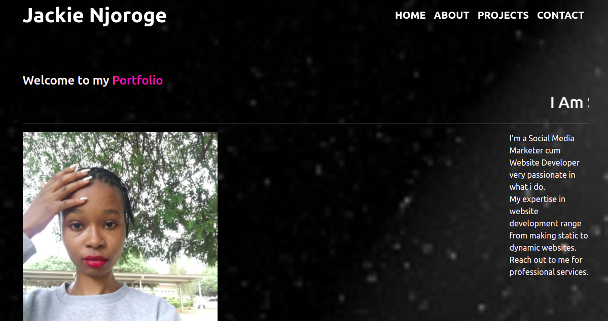

# My-Personal Portfolio Website
This is a portfolio landing page demonstration that one can create so that the world can know about you and the services you offer.

By **Jackline Njoroge**

## Description
A portfolio is what represents someone or their work. My personal portfolio website is a project built with HTML languange, CSS and BOOTSTRAP libraries. It contains the following sections:
<ul>
   <li>Home</li>
    <li>About</li>
     <li>Projects</li>
      <li>Contact</li>

</ul>

This website tells about me and the services i offer; it can be cloned and customized so as to fit anyone's requirements.

## Features
<ul>
   <li>Private messaging</li>
    <li>Other awesome features yet to be implemented</li>

</ul>

## Setup Requirements

<ul>
   <li>Clone this repo to your desktop.</li>
    <li>Download Atom or Visual studio code editor to customize your code</li>
     
</ul>

## Technologies used
BOOTSTRAP libraries 

HTML programming language

CSS

## Support and contact details
In case of any issues, feel free to make a contribution to the code or email me bobbinnej@gmail.com.

## License
This project is licensed under the terms of the **MIT** license.

